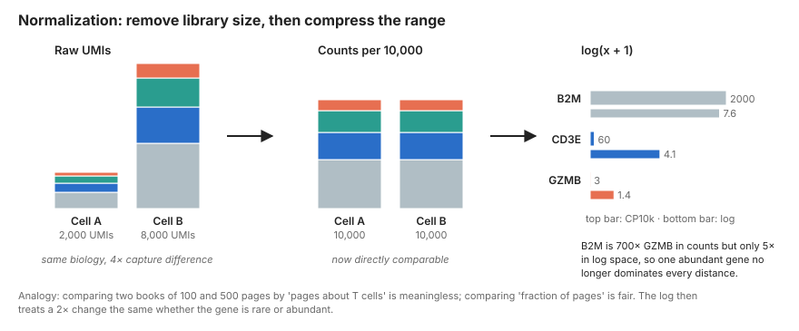
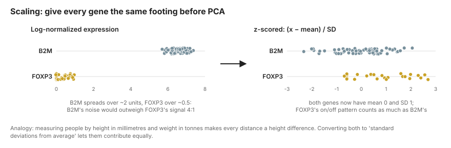
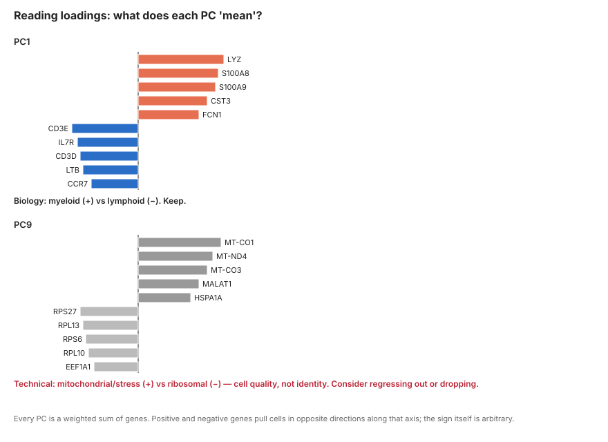

# Normalization and Principal Components {#sec-pca}

::: {.objectives}
**Learning objectives**

- Explain why raw UMI counts cannot be compared between cells and what log-normalization and SCTransform each do about it
- Justify feature selection: why we cluster on ~2,000 genes rather than 20,000
- Describe principal component analysis geometrically, read an elbow plot, and inspect PC loadings for technical artefacts
- Produce a scaled, reduced representation of the data ready for graph construction
:::

## Concepts

### Normalization: making cells comparable

Two cells with identical biology can differ tenfold in total UMIs purely through capture efficiency. Before we can say "cell A expresses more `GZMB` than cell B" we must remove that global scaling factor.

The standard approach has two steps:

1. **Library-size scaling.** Divide each cell's counts by its total UMIs and multiply by a common target (10,000 is conventional), giving counts-per-10k (CP10k). Every cell now "has" 10,000 UMIs.
2. **Log transform.** Take $\log(x + 1)$. This compresses the dynamic range so that a highly expressed gene like `B2M` (thousands of counts) does not dominate every distance computation, stabilises the variance, and makes differences roughly proportional (a doubling is the same distance everywhere).

{#fig-normalization}

::: {.concept}
**Why the +1?** $\log(0)$ is undefined, and most entries are zero. The pseudocount keeps zeros at zero. It has a known side effect: for lowly expressed genes it creates a spurious relationship between library size and normalized value, which is one motivation for SCTransform.
:::

**SCTransform** (Hafemeister & Satija, 2019) takes a different route. It fits a regularised negative-binomial regression of each gene's counts on sequencing depth, then uses the **Pearson residuals** (how far each observed count deviates from what the model predicts for a cell of that depth) as the normalized value. Residuals are centred, variance-stabilised and free of the depth artefact. In practice both methods yield similar clusters on PBMCs; SCTransform tends to separate subtle states a little better and log-normalization is simpler to interpret. We show log-normalization as the default and note SCTransform in the code.

### Feature selection: highly variable genes

Of ~20,000 detected genes, most vary between cells only through sampling noise (housekeeping genes) or are so rare they carry no signal. Including them in distance computations adds noise. We therefore pick ~2,000 **highly variable genes (HVGs)**: genes whose variance across cells exceeds what we expect from their mean expression alone.

The key insight is that in count data variance rises with the mean, so "most variable" naively just means "most highly expressed". HVG methods fit the mean–variance trend and select genes that sit *above* it. The `vst` / `seurat_v3` method does this on raw counts; the older `dispersion` method does it on log-normalized data after binning by mean.

::: {.immuno}
**Immune data and HVGs.** Cell-type marker genes (`CD3E`, `MS4A1`, `LYZ`) reliably become HVGs because they are on in some cells and off in others. So do TCR and immunoglobulin variable genes (`TRBV*`, `IGKV*`), for the wrong reason: each clone uses a different V gene, so these genes vary enormously between cells without reflecting cell *state*. If your T cell clusters split by clone rather than by phenotype, exclude `TRAV/TRBV/TRDV/TRGV/IGHV/IGKV/IGLV` genes from the HVG list. We show how below.
:::

### Scaling

Even after log-normalization, genes live on very different scales. `B2M` sits around 6–7 log units in every cell and wobbles by a unit or two through sampling noise. `FOXP3` is zero in most cells and around 0.5–1 in Tregs. That on/off pattern is the biology we care about, but in raw log units `B2M`'s *noise* is several times larger than `FOXP3`'s *signal*. Any method that measures distance between cells would be listening to `B2M`.

{#fig-scaling}

**Scaling** fixes this by **z-scoring** each HVG across cells: subtract the gene's mean, divide by its standard deviation. Every gene now has mean 0 and unit variance, so each contributes equally to what follows. The cost is that a gene's absolute expression level is thrown away; only *relative* patterns across cells remain, which is exactly what we want for finding structure. Values are usually clipped (e.g. at ±10) so that a single extreme cell cannot define a principal component on its own.

### Principal component analysis

We now have a matrix of ~10,000 cells in a ~2,000-dimensional gene space. Distances in 2,000 dimensions are noisy (every gene contributes sampling error) and expensive. PCA finds a much smaller set of axes that capture most of the *structured* variation.

Start with just two genes so the picture fits on a page.

{#fig-pca}

::: {.concept}
**PCA, geometrically.** In @fig-pca (A) every cell is a point whose coordinates are its scaled `CD3E` and `LYZ` values. Monocytes sit top-left (high `LYZ`, low `CD3E`); T cells sit bottom-right. The cloud is not round; it is a streak. PCA asks one question: *along which single direction do the points spread out the most?* That direction is **PC1**, drawn as the long arrow. It then asks the same question restricted to directions perpendicular to PC1, giving **PC2**, and so on for as many dimensions as there are genes.

Panel (B) rotates the picture so PC1 lies flat. Each cell's position along that axis is its **PC1 score**. Notice that the PC2 scores are all close to zero: almost none of the variation was lost by dropping PC2. We compressed two genes into one number without losing the monocyte-versus-T-cell information.

**A worked example.** Take the five labelled cells. After scaling their (`CD3E`, `LYZ`) values are A = (−1.2, 1.1), B = (−0.9, 0.8), C = (0.9, −1.0), D = (1.1, −0.9), E = (0.1, 0.0). PC1 points along (0.71, −0.71): that is, it is the weighted sum $0.71 \times \text{CD3E} - 0.71 \times \text{LYZ}$. Those weights are the **loadings**. A cell's PC1 score is just that sum: A scores $0.71(-1.2) - 0.71(1.1) = -1.6$, C scores $+1.3$, E scores $+0.07$. PC2 uses loadings (0.71, 0.71); A scores $-0.07$, C scores $-0.07$. Every cell has a large PC1 score and a tiny PC2 score, which is the numerical version of "the streak is one-dimensional".

In real data there are 2,000 HVGs instead of two, so each PC is a weighted sum of 2,000 genes and there are 2,000 possible PCs. The geometry is identical; we just cannot draw it. Mathematically the PCs are the eigenvectors of the gene–gene covariance matrix and the variance along each PC is the corresponding eigenvalue, which is what the elbow plot in panel (C) shows.
:::

```{mermaid}
%%| fig-cap: "Why we reduce dimensions: genes co-vary in programmes, so a few axes summarise thousands of genes."
flowchart LR
  A["2,000 HVGs\n(noisy, correlated)"] -->|PCA| B["30–50 PCs\n(compact, denoised)"]
  B --> C[kNN graph]
  B --> D[UMAP]
  C --> E[Clusters]
```

Two practical questions follow.

**How many PCs?** The **elbow plot** shows variance explained per PC. Typically the first 10–20 PCs each explain substantial variance and then the curve flattens into a floor of noise. Choosing anywhere from the elbow to slightly past it (commonly 20–40 PCs) is fine; downstream results are robust to this choice within reason. Too few PCs loses rare populations (which often live on a single mid-ranked PC); too many adds noise but rarely breaks anything.

**What is each PC?** Look at the loadings, as in @fig-loadings. PC1 in PBMCs is almost always lymphoid versus myeloid (`LYZ`, `S100A8` on one side; `CD3E`, `IL7R` on the other). PC2 is often T/NK versus B. If a PC is loaded with ribosomal genes, `MALAT1`, mitochondrial genes, heat-shock genes or `MKI67`/`TOP2A`, that PC is tracking cell quality, dissociation stress or cell cycle rather than identity, and you should decide whether to regress that signal out.

{#fig-loadings}

## Hands-on

### Normalize

::: {.panel-tabset group="language"}
## R (Seurat)
```r
library(Seurat)
pbmc <- readRDS("data/processed/01_pbmc_qc.rds")

# Default: log(CP10k + 1), stored in the "data" layer
pbmc <- NormalizeData(pbmc, normalization.method = "LogNormalize", scale.factor = 1e4)

# Alternative: SCTransform (creates an "SCT" assay; skip ScaleData if you use this)
# pbmc <- SCTransform(pbmc, vst.flavor = "v2", verbose = FALSE)

# Compare raw and normalized for one gene
LayerData(pbmc, layer = "counts")["CD3E", 1:5]
LayerData(pbmc, layer = "data")["CD3E", 1:5]
```

## Python (Scanpy)
```python
import scanpy as sc
adata = sc.read_h5ad("data/processed/01_pbmc_qc.h5ad")

# Keep raw counts: HVG selection (seurat_v3) and TCR/pseudobulk steps need them
adata.layers["counts"] = adata.X.copy()

sc.pp.normalize_total(adata, target_sum=1e4)
sc.pp.log1p(adata)

# Alternative: analytic Pearson residuals (SCTransform-like)
# sc.experimental.pp.normalize_pearson_residuals(adata)
```
:::

### Select highly variable genes

::: {.panel-tabset group="language"}
## R (Seurat)
```r
pbmc <- FindVariableFeatures(pbmc, selection.method = "vst", nfeatures = 2000)

# Remove TCR/BCR variable-region genes so clones do not drive clustering
vdj_genes <- grep("^(TR[ABDG]V|IG[HKL]V)", VariableFeatures(pbmc), value = TRUE)
length(vdj_genes)
VariableFeatures(pbmc) <- setdiff(VariableFeatures(pbmc), vdj_genes)

top10 <- head(VariableFeatures(pbmc), 10)
LabelPoints(VariableFeaturePlot(pbmc), points = top10, repel = TRUE)
```

## Python (Scanpy)
```python
sc.pp.highly_variable_genes(
    adata, n_top_genes=2000, flavor="seurat_v3", layer="counts"
)

# Remove TCR/BCR variable-region genes from the HVG set
import re
is_vdj = adata.var_names.str.match(r"^(TR[ABDG]V|IG[HKL]V)")
print(f"Excluding {(adata.var['highly_variable'] & is_vdj).sum()} V(D)J genes")
adata.var.loc[is_vdj, "highly_variable"] = False

sc.pl.highly_variable_genes(adata)

# Freeze the full log-normalized matrix for plotting and DE later
adata.raw = adata
```
:::

### Scale and run PCA

::: {.panel-tabset group="language"}
## R (Seurat)
```r
# Scale only the HVGs (default). To regress out a nuisance variable:
#   ScaleData(pbmc, vars.to.regress = c("percent.mt", "S.Score", "G2M.Score"))
pbmc <- ScaleData(pbmc)

pbmc <- RunPCA(pbmc, npcs = 50, verbose = FALSE)

# Which genes define the first PCs?
print(pbmc[["pca"]], dims = 1:3, nfeatures = 8)
VizDimLoadings(pbmc, dims = 1:2, reduction = "pca")

DimPlot(pbmc, reduction = "pca", dims = c(1, 2))
DimHeatmap(pbmc, dims = 1:6, cells = 500, balanced = TRUE)

# Choose the number of PCs
ElbowPlot(pbmc, ndims = 50)
```

## Python (Scanpy)
```python
# Optional: regress out nuisance covariates before scaling
# sc.pp.regress_out(adata, ["pct_counts_mt"])

sc.pp.scale(adata, max_value=10)     # z-score, clip at ±10
sc.tl.pca(adata, n_comps=50, svd_solver="arpack", mask_var="highly_variable")

sc.pl.pca_variance_ratio(adata, n_pcs=50, log=True)   # the "elbow plot"
sc.pl.pca(adata, color=["CD3E", "LYZ", "MS4A1"], components=["1,2"])
sc.pl.pca_loadings(adata, components=[1, 2, 3])
```
:::

### Optional: cell-cycle scoring

Cycling lymphocytes (proliferating effector T cells, plasmablasts) often form their own cluster regardless of lineage. Score the cell cycle now so you can decide later whether to regress it out or keep it as biology.

::: {.panel-tabset group="language"}
## R (Seurat)
```r
s.genes   <- cc.genes.updated.2019$s.genes
g2m.genes <- cc.genes.updated.2019$g2m.genes
pbmc <- CellCycleScoring(pbmc, s.features = s.genes, g2m.features = g2m.genes)
table(pbmc$Phase)

saveRDS(pbmc, "data/processed/02_pbmc_pca.rds")
```

## Python (Scanpy)
```python
# Regev lab cell-cycle gene list (Tirosh et al. 2016); download from
# https://github.com/scverse/scanpy_usage/tree/master/180209_cell_cycle
cc = [l.strip() for l in open("data/raw/regev_lab_cell_cycle_genes.txt")]
s_genes, g2m_genes = cc[:43], cc[43:]
sc.tl.score_genes_cell_cycle(adata, s_genes=s_genes, g2m_genes=g2m_genes)
adata.obs["phase"].value_counts()

adata.write_h5ad("data/processed/02_pbmc_pca.h5ad")
```
:::

## Pitfalls

::: {.pitfall}
- **Running PCA on unscaled data.** A handful of abundant genes will define every PC.
- **Using all genes instead of HVGs.** Slower and noisier, with no gain.
- **Leaving TCR/BCR V genes in the HVG set.** Clones cluster separately, and clonal expansion masquerades as cell state.
- **Regressing out variables reflexively.** Regressing out mitochondrial fraction or cell cycle removes real biology if those correlate with cell state (they do, for activated T cells). Inspect first, regress only if a PC is clearly technical.
- **Treating the number of PCs as sacred.** Anything from 20 to 50 usually works. If you want to be careful, run downstream clustering with 20 and 40 PCs and check what changes.
- **Interpreting PC scores directly as cell types.** PCs are axes of variance, not categories. PC1 separating lymphoid from myeloid does not mean "PC1 = monocyte score".
:::

## Exercises

1. Print the top 20 loadings for PCs 1–5 and give each a biological name. Is any PC technical?
2. Repeat HVG selection *without* excluding V(D)J genes. How many of the top 100 HVGs are `TRBV`/`TRAV`/`IG*V` genes?
3. Compare `LogNormalize` and SCTransform (or Pearson residuals): how many HVGs overlap between the two methods?
4. *(Stretch)* Compute the correlation between each of PCs 1–20 and `percent.mt`, `nCount`, and the S/G2M scores. Which PCs would you consider regressing out, and what would you lose?
