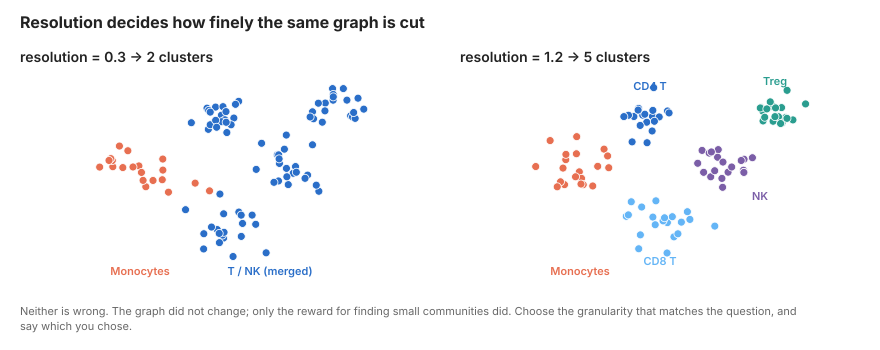
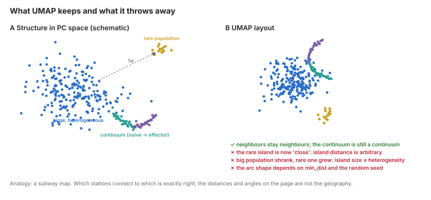

# Neighbours, Clustering and UMAP {#sec-clustering}

::: {.objectives}
**Learning objectives**

- Explain how a k-nearest-neighbour graph turns a point cloud into a network, and why clustering operates on the graph rather than on the UMAP
- Describe what Louvain/Leiden community detection optimises and what the resolution parameter controls
- Describe what UMAP does, what its two main parameters do, and which visual features of a UMAP are and are not meaningful
- Assess cluster robustness rather than accepting one clustering as truth
:::

## Concepts

### From points to a graph: k-nearest neighbours

After PCA each cell is a point in ~30-dimensional space. The next step builds a **k-nearest-neighbour (kNN) graph**: for each cell, find the $k$ cells closest to it (Euclidean distance in PC space; $k$ = 15–30 is typical) and draw an edge to each. The graph now encodes local structure: which cells are transcriptionally similar to which.

Seurat and Scanpy then refine this into a **shared-nearest-neighbour (SNN)** graph. Two cells are connected with weight proportional to how many neighbours they *share* (the Jaccard index of their neighbour sets). Two cells that are each other's neighbours *and* have largely overlapping neighbourhoods are strongly connected; two cells that happen to be close but sit in different neighbourhoods are weakly connected. This makes the graph robust to a few cells lying between populations.

{#fig-graph}

::: {.concept}
**Why a graph?** In high dimensions, absolute distances are unreliable (the "curse of dimensionality"): almost everything is roughly equally far from everything else. Relative distance is reliable: "these are my 20 closest cells" is a stable statement even when "this cell is 3.7 units away" is not. Graph methods use only the relative information. Every downstream step in this chapter (clustering, UMAP, later trajectory inference) is a computation on this graph.
:::

```{mermaid}
%%| fig-cap: "The graph is the central object. Clustering and UMAP are two independent views of it."
flowchart TD
  A[PC embedding\ncells × 30] --> B["kNN / SNN graph\n(k ≈ 20)"]
  B --> C["Leiden clustering\n(partitions the graph)"]
  B --> D["UMAP\n(lays out the graph in 2-D)"]
  C -.->|colour| E[Plot]
  D -.->|coordinates| E
```

### Clustering: community detection

**Louvain** and its successor **Leiden** are algorithms that partition a graph into communities: groups of nodes densely connected to each other and sparsely connected to the rest. They maximise **modularity**, a score that compares the number of edges inside communities with the number expected if edges were placed at random.

The **resolution** parameter scales how many edges "random" expects. Higher resolution means the algorithm is rewarded for finding smaller, tighter communities; lower resolution merges them. There is no correct resolution. Resolution 0.3 on PBMCs gives you T, B, NK, monocyte, DC; resolution 1.5 splits T cells into naive CD4, memory CD4, Treg, naive CD8, effector CD8, MAIT, γδ and a few clusters you will struggle to name. Both are valid descriptions at different granularities (@fig-resolution).

{#fig-resolution}

::: {.concept}
**Clusters are hypotheses, not discoveries.** The algorithm will always return clusters, including on data with no structure. A cluster is the statement "these cells are more similar to each other than to their neighbours at this resolution". Whether that similarity corresponds to a cell type, a cell state, an activation gradient cut arbitrarily into pieces, a batch, or a quality artefact is a biological question answered in Week 4. Leiden is preferred over Louvain because it guarantees connected communities and is faster; results are otherwise similar.
:::

### UMAP: seeing the graph

**Uniform Manifold Approximation and Projection** takes the same kNN graph and finds a 2-D layout in which cells that are neighbours in the graph end up close together. Roughly: it converts neighbour distances into edge probabilities (a fuzzy graph), then moves points around in 2-D so that connected cells attract and unconnected cells repel, minimising a cross-entropy between the high-dimensional and low-dimensional graphs.

Two parameters matter:

- **`n_neighbors`** (default 15–30): the size of the neighbourhood UMAP tries to preserve. Small values emphasise fine local structure and fragment the plot; large values emphasise global arrangement and blur small populations.
- **`min_dist`** (default 0.3–0.5): how tightly points may pack. Small values give dense, well-separated islands; large values give a diffuse cloud that better shows continua.

{#fig-umap}

::: {.concept}
**What a UMAP does and does not tell you** (see @fig-umap)

*Reliable:*

- Cells in the same island are neighbours in the graph (local structure is preserved).
- A continuous smear usually reflects a real gradient (e.g. naive → memory → effector).

*Not reliable:*

- **Distance between islands.** UMAP places islands wherever the layout optimiser puts them. B cells being "far from" monocytes carries no quantitative meaning.
- **Island size.** UMAP expands dense regions and compresses sparse ones. A big island is not a more heterogeneous population.
- **Shape.** Arms, branches and rings are often artefacts of `min_dist` and random seed.
- **Anything you did not test in the graph or the expression matrix.** UMAP is a picture of an analysis. It is not the analysis.

The clustering did not use the UMAP, and the UMAP did not use the clustering. When a cluster straddles two islands or an island contains two clusters, that is the graph and the layout disagreeing about ambiguous cells, not an error.
:::

**t-SNE** is the older alternative. It preserves local structure similarly but has no meaningful global arrangement at all, is slower, and cannot embed new cells into an existing layout. UMAP has largely replaced it; the caveats above apply to both.

### Assessing robustness

Because resolution is arbitrary and Leiden has a random component, check that clusters you intend to interpret survive perturbation:

- Cluster at several resolutions and draw a **cluster tree** (`clustree`) to see which splits are stable across resolutions and which flicker.
- Compute a **silhouette score** per cluster in PC space: cells with negative silhouette are closer to another cluster than their own.
- Re-run with a different random seed and compare with the adjusted Rand index.
- Check that no cluster is defined by `nCount`, `percent.mt` or cell-cycle phase alone.

## Hands-on

### Build the graph and cluster

::: {.panel-tabset group="language"}
## R (Seurat)
```r
library(Seurat)
library(ggplot2)
pbmc <- readRDS("data/processed/02_pbmc_pca.rds")

pbmc <- FindNeighbors(pbmc, reduction = "pca", dims = 1:30, k.param = 20)

# Cluster at several resolutions. algorithm = 4 is Leiden (needs the Python
# 'leidenalg' package via reticulate); algorithm = 1 (Louvain) needs nothing.
for (res in c(0.3, 0.5, 0.8, 1.2)) {
  pbmc <- FindClusters(pbmc, resolution = res, algorithm = 4,
                       cluster.name = paste0("leiden_", res), verbose = FALSE)
}
table(pbmc$leiden_0.8)
Idents(pbmc) <- "leiden_0.8"
```

## Python (Scanpy)
```python
import scanpy as sc
adata = sc.read_h5ad("data/processed/02_pbmc_pca.h5ad")

sc.pp.neighbors(adata, n_neighbors=20, n_pcs=30, random_state=0)

for res in [0.3, 0.5, 0.8, 1.2]:
    sc.tl.leiden(
        adata, resolution=res, key_added=f"leiden_{res}",
        flavor="igraph", n_iterations=2, directed=False, random_state=0
    )
adata.obs["leiden_0.8"].value_counts()
```
:::

### Compute and plot UMAP

::: {.panel-tabset group="language"}
## R (Seurat)
```r
pbmc <- RunUMAP(pbmc, dims = 1:30, n.neighbors = 30, min.dist = 0.3, seed.use = 1)

DimPlot(pbmc, reduction = "umap", group.by = "leiden_0.8", label = TRUE) + NoLegend()

# Clusters at different resolutions on the same layout
DimPlot(pbmc, group.by = c("leiden_0.3", "leiden_0.8", "leiden_1.2"), label = TRUE, ncol = 3)

# Is any cluster a QC artefact?
FeaturePlot(pbmc, features = c("nCount_RNA", "percent.mt", "S.Score", "G2M.Score"))
VlnPlot(pbmc, features = c("nCount_RNA", "percent.mt"), pt.size = 0, ncol = 2)
```

## Python (Scanpy)
```python
sc.tl.umap(adata, min_dist=0.3, random_state=0)

sc.pl.umap(adata, color="leiden_0.8", legend_loc="on data", frameon=False)
sc.pl.umap(adata, color=["leiden_0.3", "leiden_0.8", "leiden_1.2"],
           legend_loc="on data", frameon=False, ncols=3)

# Is any cluster a QC artefact?
sc.pl.umap(adata, color=["total_counts", "pct_counts_mt", "S_score", "G2M_score"],
           frameon=False, ncols=4)
sc.pl.violin(adata, ["total_counts", "pct_counts_mt"], groupby="leiden_0.8", rotation=90)
```
:::

### Explore UMAP parameters

Run this once so you never again over-interpret an island shape.

::: {.panel-tabset group="language"}
## R (Seurat)
```r
plots <- list()
for (md in c(0.05, 0.3, 0.8)) for (nn in c(10, 30, 100)) {
  tmp <- RunUMAP(pbmc, dims = 1:30, n.neighbors = nn, min.dist = md,
                 reduction.name = "tmp", verbose = FALSE)
  plots[[paste(md, nn)]] <- DimPlot(tmp, reduction = "tmp", group.by = "leiden_0.8") +
    NoLegend() + ggtitle(paste0("min.dist=", md, " n.neighbors=", nn))
}
patchwork::wrap_plots(plots, ncol = 3)
```

## Python (Scanpy)
```python
import matplotlib.pyplot as plt
fig, axes = plt.subplots(3, 3, figsize=(12, 12))
for i, md in enumerate([0.05, 0.3, 0.8]):
    for j, nn in enumerate([10, 30, 100]):
        tmp = adata.copy()
        sc.pp.neighbors(tmp, n_neighbors=nn, n_pcs=30)
        sc.tl.umap(tmp, min_dist=md)
        sc.pl.umap(tmp, color="leiden_0.8", ax=axes[i, j], show=False,
                   legend_loc=None, title=f"min_dist={md}, n_neighbors={nn}")
plt.tight_layout()
```
:::

### Check robustness

::: {.panel-tabset group="language"}
## R (Seurat)
```r
# Cluster tree across resolutions
library(clustree)
clustree(pbmc, prefix = "leiden_")

# Silhouette in PC space
library(cluster)
pcs  <- Embeddings(pbmc, "pca")[, 1:30]
sil  <- silhouette(as.integer(pbmc$leiden_0.8), dist(pcs))
pbmc$silhouette <- sil[, "sil_width"]
VlnPlot(pbmc, "silhouette", group.by = "leiden_0.8", pt.size = 0)

saveRDS(pbmc, "data/processed/03_pbmc_clustered.rds")
```

## Python (Scanpy)
```python
from sklearn.metrics import silhouette_samples, adjusted_rand_score

adata.obs["silhouette"] = silhouette_samples(
    adata.obsm["X_pca"][:, :30], adata.obs["leiden_0.8"]
)
sc.pl.violin(adata, "silhouette", groupby="leiden_0.8", rotation=90)

# Seed stability
sc.tl.leiden(adata, resolution=0.8, key_added="leiden_0.8_seed7",
             flavor="igraph", n_iterations=2, random_state=7)
print("ARI between seeds:",
      adjusted_rand_score(adata.obs["leiden_0.8"], adata.obs["leiden_0.8_seed7"]))

adata.write_h5ad("data/processed/03_pbmc_clustered.h5ad")
```
:::

## Pitfalls

::: {.pitfall}
- **Clustering on the UMAP coordinates.** Some tools let you. Never do it: UMAP has thrown away most of the information.
- **Reading distances between islands.** "Tregs are closer to naive CD4 than to Th17 on the UMAP" is not a finding.
- **Reporting one resolution as *the* clustering.** State the resolution, show the tree, and justify the granularity by the question.
- **Over-clustering then annotating every cluster as a distinct type.** At resolution 2 a continuous activation gradient becomes six "subsets".
- **Not checking QC per cluster.** A cluster with low UMIs and high mitochondrial fraction is dying cells, not a novel population.
- **Forgetting the random seed.** UMAP layouts and Leiden partitions are stochastic. Fix seeds for reproducibility; vary them to test robustness.
:::

## Exercises

1. Which clusters at resolution 1.2 merge into a single cluster at 0.3? Use the cluster tree to identify the most and least stable splits.
2. Find the cluster with the lowest median silhouette. Which other cluster are its cells closest to? Propose a biological reason.
3. Recompute the UMAP with `min_dist = 0.05` and `n_neighbors = 10`. Which populations now appear as multiple islands? Are they multiple clusters in the graph?
4. Revisit Exercise 2 from Week 1: at your three mitochondrial thresholds, which clusters lose the most cells? Would a 5% cutoff have removed a population you care about?
5. *(Stretch)* Compute t-SNE alongside UMAP. Colour both by `leiden_0.8`. Which relationships appear in one but not the other, and why does that not matter?
